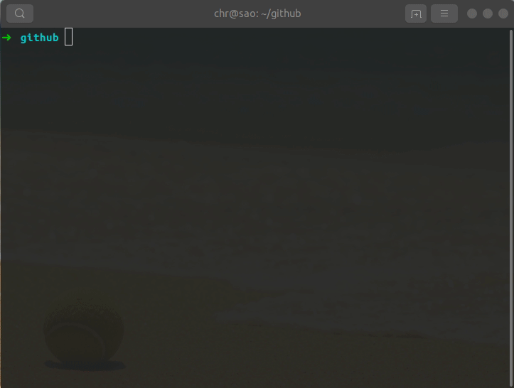

# iconfont-tools

适用于 iconfont 彩色图标的提取

<div>


</div>

## 特性

- 生成原生通用组件 icon
- 生成夸平台可用的 iconfont-weapp.css 文件
- 本地生产，也可以远程生成

## 如何安装

方式一：

> 需要下载，iconfont 的字体文件包，将其解压

```shell

npm i -g iconfont-tools

cd project/asset/font_hiytajitqeu // 进入图标文件所在文件夹

iconfont-tools  // 生成小程序专用文件

```

方式二：

> 无需下载字体包，但是需要在 iconfont 生成在线链接


```shell

npm i -g iconfont-tools

# 复制在线链接 //at.alicdn.com/t/font_717026_fqwb5om0rvk.js

iconfont-tools --from //at.alicdn.com/t/font_717026_fqwb5om0rvk.js --to ./output/dir-path

```

参数：

- --from: iconfont 在线链接
- --to： 生成目标路径，可以是绝对路径，也可以是相对路径。 dome： /home/chr/project/style ./style

## 小程序 如何使用

- 1.直接引用样式

```HTML
<view class="t-icon t-icon-your-iconName"></view>
```

- 2.使用组件 icon

page.json

```json
{
  "usingComponents": {
    "icon": "/path/to-icon/icon"
  }
}
```

page.wxml

```HTML
<icon name="IconName" size="{{24}}"></icon>
```

## 实现原理

[click](./docs/README.md)

## 演示


