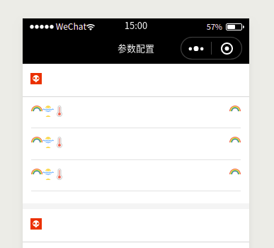
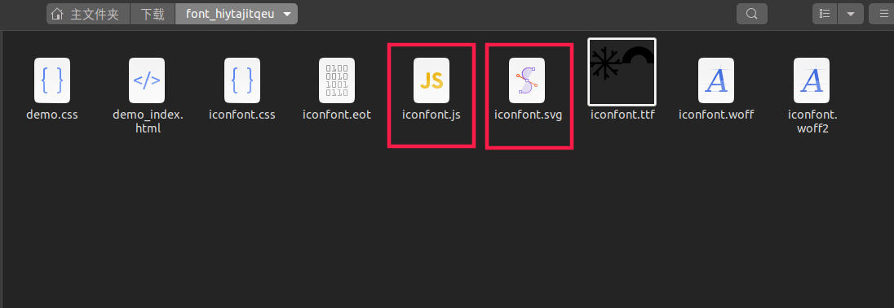
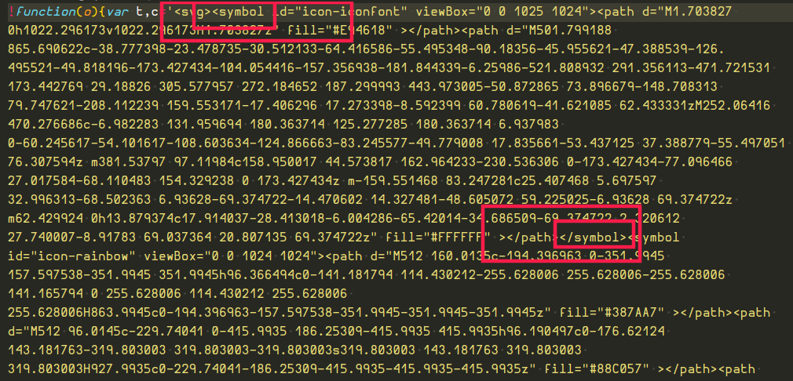

# iconfont-tools 原理

国际惯例，先上图：  


## 概要

一般我们在开发的时候，都是采用 iconfont 来管理项目里的图标，方便快捷。但是当我需要将项目迁移的小程序的时候，就遇到了很多问。iconfont 字体怎么引入？不支持 dom 操作，字体怎么操作？彩色字体怎么使用？  
各种问题困扰着我们，我们可能会有各种折中的方案，比如线上字体 CDN 引入，字体 base64，雪碧图等等。

## 全新的方式 iconfont-tools 快速生成彩色图标库

https://github.com/HuaRongSAO/iconfont-tools  
欢迎点赞


```sh
npm  i  -g  iconfont-tools

cd  project/asset/font_hiytajitqeu  // 进入图标文件所在文件夹

iconfont-tools  // 生成小程序专用文件
```

生成目标文件：

```sh
.
└── font_hiytajitqeu
    ├── demo.css
    ├── demo_index.html
    ├── iconfont.css
    ├── iconfont.eot
    ├── iconfont.js
    ├── iconfont.svg
    ├── iconfont.ttf
    ├── iconfont.woff
    └── iconfont.woff2
    ├── iconfont-weapp        # 目标文件夹
    │   ├── icon              # 生成原生的icon组件库
    │   │   ├── icon.js
    │   │   ├── icon.json
    │   │   ├── icon.wxml
    │   │   └── icon.wxss
    │   ├── iconfont-weapp-icon.css  # 包含彩色图标的css
    │   └── iconfont-weapp-icon.wxss # 包含彩色图标的wxss

```

最后：

- 方式一：引入小程序项目： @import '/your/path/font_hiytajitqeu/iconfont-weapp/iconfont-weapp-icon.wxss'
- 方式二：注册组件："icon": "/your/path/font_hiytajitqeu/iconfont-weapp/icon"

其他小程序框架，taro，wepy，mpvue 等等，可以直接通过引入`iconfont-weapp-icon.css`文件，实现。

## 原理

实现原理主要是通过 SVG 作为背景图进行实现的。  
一般我们实现一张图标的实现方式是通过 base64 作为背景图实现实现的如下图

```css
.icon {
  width: 20px;
  height: 20px;
  background: url(data:image/svg+xml;base64, PHN2ZyB2ZXJza..) no-repeat center;
  background-size: 100%;
}
```

但是通过 base64 位生成背景图，有个小问题，主要是因为 base64 算法的问题，会增加代码的数量从而增加文件大小。
简单原理：大概就是字符串的 3 个字符转化成 4 位字符  
通过 base64 加密后会使文件大小增加 2,30%

于是就有了新的引入方式：

SVG 直接内联

```css
.icon {
  width: 20px;
  height: 20px;
  background: url(<svg version="1.1" xmlns="http://www.w3.org/2000/svg" width="200" height="200" viewBox="0 0 200 200"><path fill="#00A5E0" d="M145.659,68.949c-5.101-5.208-13.372-5.208-18.473,0L99.479,97.233 L71.772,68.949c-5.1-5.208-13.371-5.208-18.473,0c-5.099,5.208-5.099,13.648,0,18.857l46.18,47.14l46.181-47.14 C150.759,82.598,150.759,74.157,145.659,68.949z"/></svg>') no-repeat center;
  background-size: 100%;
}
```

这不就很完美了嘛！  
可惜在存在兼容性问题，在 IE 就可能无法线上了。  
那问题出在哪？  
`"，%，#，{，}，<，>`这些特殊符号。

找到了问题，那解决方式就有了，`encodeURIComponent`对数据进行 url 编码。

```css
.icon {
  width: 20px;
  height: 20px;
  background: url(data:image/svg+xml,%3C%3Fxml%20version%3D%221.0%22%20encoding%3D%22utf-8%22%3F%3E%3Csvg%20versi...)
    no-repeat center;
  background-size: 100%;
}
```

这样 svg 的显示方案就做好了。

## 从 iconfont 中提取我们需要 SVG

下载解压完毕的 iconfont 一般长这样  


其中 svg 的代码，在 iconfont.js 和 iconfont.svg 两个文件

通过详细对比和仔细阅读源码，发现答案就在 iconfont.js 里面  


图中画红框的位置，就是 svg 的全部源码了。

那么实现方式就很明朗了

```shell

找到对应的svg标签 ==> 提取标签 ===> encodeURIComponent 编码标签 ==> 生成css文件

```

好的大功告成！

那么问题来，工具怎么下载?

https://github.com/HuaRongSAO/iconfont-tools

蟹蟹

相关阅读：
[张鑫旭:CSS 中内联 SVG 图片](https://www.zhangxinxu.com/wordpress/2018/08/css-svg-background-image-base64-encode/)  
[base64](https://zh.wikipedia.org/wiki/Base64)
